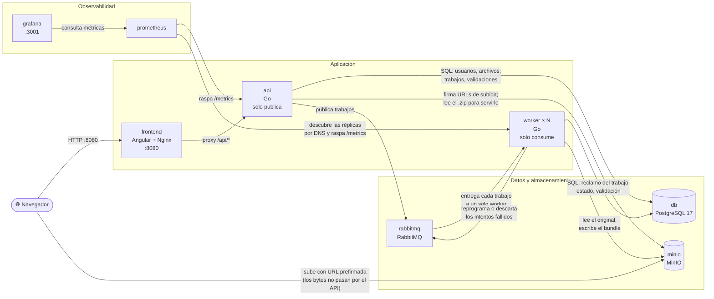
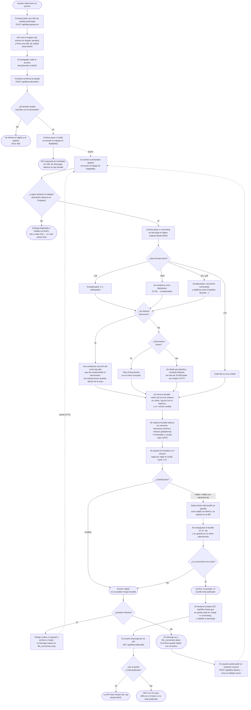

# OKF Converter

OKF Converter es una aplicación web multiusuario que convierte documentos en
bundles de conocimiento en formato OKF. Un usuario se autentica y sube un
archivo; la API responde de inmediato con un identificador de trabajo y la
conversión ocurre en segundo plano, en workers independientes. El resultado
es un bundle: una carpeta autocontenida con un índice, una bitácora de la
conversión y un documento Markdown por cada unidad lógica del documento
original.

## El bundle

```
notas-de-clase/
├── index.md              navegación y datos del bundle
├── log.md                trazabilidad de la conversión
├── 01-introduccion.md    un documento por unidad lógica,
├── 02-metodologia.md     numerado en el orden del original
└── 03-conclusiones.md
```

`index.md` enumera y enlaza los conceptos en el orden del documento de
origen, junto con los datos del bundle (documento original, tipo, tamaño,
número de unidades y trabajo que lo produjo). `log.md` registra, con marca de
tiempo, cada operación de la conversión y una tabla de las unidades
detectadas con su procedencia. Cada concepto abre con su título, lleva el
contenido de su unidad y cierra con enlaces al índice y a sus vecinos, de
modo que el bundle se puede recorrer completo desde cualquier archivo.

Todos los archivos llevan frontmatter YAML, como pide
[Open Knowledge Format v0.1](https://cloud.google.com/blog/products/data-analytics/how-the-open-knowledge-format-can-improve-data-sharing),
que define un bundle como un directorio de Markdown con frontmatter y exige
exactamente un campo en cada concepto: `type`. Se rellenan además los campos
estándar consultables que el generador puede conocer:

```yaml
---
type: "concept"
title: "Introducción"
description: "Unidad 1 de 3 del documento «notas-de-clase.md»."
tags: ["okf", "notas-de-clase"]
source: "notas-de-clase.md"
timestamp: 2026-08-15T18:42:04Z
---
```

`index.md` y `log.md` son nombres reservados por la especificación y llevan
`type: index` y `type: log`. Los conceptos se enlazan entre sí con enlaces
Markdown normales, que es la forma en que OKF representa el grafo de
relaciones.

Un resultado exitoso nunca es un Markdown suelto: o se generan todos los
archivos del bundle, o el trabajo falla. Un documento breve sin divisiones
produce un bundle igual de válido, con `index.md`, `log.md` y un único
concepto.

Los archivos del bundle se guardan además como objetos individuales en MinIO,
así que se puede leer `index.md` sin descargar el paquete completo, y el
bundle entero se empaqueta como un `.zip` con una sola carpeta raíz.

## Formatos de entrada y segmentación

Una unidad lógica es una sección del documento, no un párrafo arbitrario. La
segmentación parte de la estructura del propio documento:

| Formato | Cómo se detecta la estructura |
| --- | --- |
| Markdown (`.md`) | Encabezados ATX (`#`) y subrayados setext; lo que está dentro de un bloque de código no cuenta |
| HTML (`.html`, `.htm`) | Se renderiza a Markdown (`<h1>`–`<h6>` → encabezados) y se segmenta igual; `<script>`, `<style>` y `<head>` se descartan |
| Texto plano (`.txt`) | Encabezados Markdown, secciones numeradas (`3.1 Metodología`, `1. Introducción`) y palabras clave (`Capítulo IV`, `Sección 2`) |
| PDF (`.pdf`) | Se extrae el texto reconstruyendo los espacios por posición de carácter y se trata como texto plano |
| CSV (`.csv`) | Cada fila es una unidad; ninguna detección de encabezados encontraría sus divisiones reales |

Dos decisiones que vale la pena conocer:

- **Se segmenta por el nivel más alto que de verdad divide el documento.** Un
  informe cuyo único encabezado de nivel 1 es su propio título se divide por
  sus secciones de nivel 2, no se deja entero. Las subsecciones quedan dentro
  de la sección a la que pertenecen.
- **Sin estructura, un documento breve es un solo concepto**, que es
  exactamente lo que pide el enunciado para el caso del documento corto sin
  divisiones. Solo un documento sin estructura y demasiado grande para eso
  (más de 20.000 bytes) cae al respaldo de dividir por párrafos.

El formato se valida en la recepción: una subida que el pipeline no podría
convertir se rechaza con `415` antes de firmar la URL, en vez de aceptarse y
fallar en un worker minutos después.

## Validación del bundle

Ningún bundle se publica sin haber sido validado. La comprobación ocurre
mientras el bundle todavía está en memoria, así que un bundle inválido nunca
llega al almacenamiento de objetos y nunca se ofrece para descarga.

Se miden dos cosas por separado:

- **Validez de plataforma** — ¿es un bundle usable?
- **Conformidad OKF** — ¿cumple la especificación Open Knowledge Format v0.1?

| Regla | Ámbito | Severidad |
| --- | --- | --- |
| Contiene `index.md`, `log.md` y al menos un concepto | plataforma | error |
| Todos los enlaces de `index.md` resuelven dentro del bundle | plataforma | error |
| Todos los conceptos son alcanzables desde `index.md` | plataforma | error |
| Los enlaces relativos dentro de los conceptos resuelven | plataforma | advertencia |
| Todos los archivos abren con frontmatter YAML | OKF | error |
| Todos los archivos declaran el campo obligatorio `type` | OKF | error |
| Todos los archivos traen los campos estándar consultables | OKF | advertencia |
| `index.md` y `log.md` declaran el tipo de su rol | OKF | advertencia |

El resultado se clasifica en **válido**, **válido con advertencias** o
**inválido**, y se guarda en la tabla `files` (`validation` y el informe regla
por regla en `validation_report`). Un bundle inválido deja el archivo en
`failed` con el motivo; uno con advertencias se publica igual y las reporta.

Que una regla sea *advertencia* y no *error* tiene una razón concreta: el
cuerpo de un concepto arrastra el Markdown del documento original, así que un
enlace relativo que el autor escribió hacia un archivo que no subió es un
defecto real que hay que reportar, pero no uno por el que valga la pena negarse
a entregar el bundle.

El veredicto completo queda también dentro del propio bundle, en la sección
`## Validación` de `log.md`, con todas las reglas —las superadas incluidas—,
que es lo que pide el §3 del enunciado sobre trazabilidad.

## Descarga del bundle

`GET /api/files/{id}/bundle` entrega el `.zip`. La descarga pasa por la API y
no por una URL prefirmada, porque es el único punto donde se pueden exigir las
dos condiciones del §6:

- **que quien pide sea el dueño del archivo** — una URL prefirmada, una vez
  entregada, le responde a quien la tenga;
- **que el bundle esté publicado** — es decir, que haya pasado la validación.

La API no carga el archivo en memoria: lo transmite por flujo desde MinIO, así
que un bundle grande le cuesta un buffer y no su tamaño completo.

| Situación | Respuesta |
| --- | --- |
| Bundle publicado | `200` con el `.zip` |
| El archivo es de otro usuario | `404` (no `403`: si un id existe o no, no es asunto de quien pregunta) |
| Todavía convirtiendo | `409` con el motivo |
| Conversión fallida o bundle inválido | `409` explicando cuál de las dos |

Los archivos individuales del bundle (`GET /api/files/{id}/outputs`) están
tras la misma puerta: un bundle que no se publicó tampoco se ofrece por
partes.

## El dashboard

Tras iniciar sesión, el usuario ve **únicamente sus propios archivos**: el
listado se acota por `user_id` en la consulta, no filtrando después, así que
un error en un handler no puede ensancharlo a los archivos de otro.

El seguimiento del estado es por sondeo (`GET /api/files`), una sola petición
por vuelta para todos los archivos que se estén siguiendo. Dos detalles
deliberados:

- **Solo se sondea si hay algo que esperar.** Un archivo en `ready` o
  `converting` está esperando a un worker; uno en `pending` es una subida que
  nunca se confirmó y que ningún worker va a tomar, así que no cuenta.
- **El sondeo se rinde a los 10 minutos**, para que un worker caído no deje
  una pestaña preguntando indefinidamente. Queda el botón «Actualizar».

El botón de descarga solo se habilita con el bundle publicado. El veredicto de
la validación se muestra junto al estado, y al abrirlo se pide el informe
regla por regla a `GET /api/files/{id}` —que no viaja en el listado
justamente porque el listado se sondea cada pocos segundos.

El selector de archivo lleva un `accept` con los formatos soportados, así que
el rechazo por formato ocurre antes incluso de la petición.

| Estado | Etiqueta |
| --- | --- |
| `pending` | Subida sin confirmar |
| `ready` | En cola |
| `converting` | Convirtiendo |
| `converted` | Bundle publicado |
| `failed` | Falló (con botón de reintento) |

## La API

Todas las rutas de `/api/files` exigen sesión y están acotadas al usuario
autenticado: el `user_id` va en la consulta SQL, no en un filtro posterior.

| Método | Ruta | Qué hace |
| --- | --- | --- |
| `POST` | `/api/auth/register` | Crea la cuenta y abre sesión |
| `POST` | `/api/auth/login` | Inicia sesión (cookie httpOnly con el JWT) |
| `POST` | `/api/auth/logout` | Cierra la sesión |
| `GET` | `/api/auth/me` | Usuario de la sesión actual |
| `POST` | `/api/auth/check-email` | Comprueba si un correo ya está registrado |
| `POST` | `/api/auth/reset-password` | Restablece la contraseña |
| `GET` | `/api/files` | Los archivos del usuario, del más reciente al más antiguo |
| `POST` | `/api/files/upload-url` | Registra el archivo y firma la URL de subida. `415` si el formato no se admite |
| `POST` | `/api/files/{id}/confirm` | Verifica la subida y encola la conversión |
| `GET` | `/api/files/{id}` | Estado del archivo + informe de validación regla por regla |
| `POST` | `/api/files/{id}/retry` | Reintento manual. Idempotente: repetirlo no encola dos veces |
| `GET` | `/api/files/{id}/outputs` | Archivos del bundle por separado, con URLs prefirmadas |
| `GET` | `/api/files/{id}/bundle` | Descarga el `.zip` por flujo |
| `GET` | `/api/health` | Sonda de salud |
| `GET` | `/metrics` | Métricas de Prometheus (también en cada worker) |

## Idempotencia y reintentos

### Una entrega duplicada no convierte dos veces

Antes de convertir nada, el worker **reclama el trabajo** con una transición
atómica en Postgres. Gana un solo reclamante; cualquier otra entrega del mismo
trabajo recibe «no reclamado», hace `ack` y no toca el convertidor. Es lo que
exige el §6: un único efecto final y, a lo sumo, un bundle publicado.

Qué estados se pueden reclamar:

| Estado del trabajo | ¿Reclamable? | Por qué |
| --- | --- | --- |
| `queued` | Sí | Trabajo nuevo, o devuelto a la espera para otro intento |
| `failed` | Sí | El intento anterior terminó y perdió; reintentar es el objetivo |
| `converting` | Solo si el mensaje viene marcado como reentrega | RabbitMQ solo reentrega cuando el canal del consumidor anterior ya no existe, así que un trabajo atascado en `converting` con un mensaje reentregado es uno cuyo worker se murió a mitad. Negarlo dejaría el archivo varado para siempre |
| `converted` | Nunca | El bundle ya está publicado, y publicar un segundo es justo lo que el §6 prohíbe |

La distinción de la tercera fila es la que hace que esto no sea una elección
entre idempotencia y recuperación: **un doble `publish` no viene marcado como
reentrega**, así que sigue quedando en un solo efecto.

Se puede demostrar publicando el mismo mensaje dos veces desde la consola de
RabbitMQ. Ayuda que el `.zip` ya sea determinista.

### Reintentos automáticos acotados

El pipeline corre sobre tres colas duraderas:

```
file_conversion         trabajos por convertir
file_conversion.retry   espera entre intentos; vence hacia la principal
file_conversion.dead    intentos agotados, para inspección
```

`file_conversion.retry` no tiene consumidor: lleva un TTL de mensaje y
devuelve por dead-letter a la cola principal cuando vence. Es la forma
estándar de retrasar una reentrega en RabbitMQ sin plugins.

**La espera es del atributo de la cola, no de cada mensaje**, y eso es
deliberado: un TTL por mensaje en una cola compartida solo expira los de la
cabeza, así que una espera larga bloquearía todas las cortas que quedaran
detrás. El costo es que la espera es fija y no exponencial.

Al agotar `WORKER_MAX_ATTEMPTS` intentos, el mensaje va a la cola de
descartes. El archivo y el trabajo quedan en `failed` con el motivo, que es lo
que ve el usuario y sobre lo que actúa el **reintento manual** del §5.2 —que
sigue existiendo y crea un trabajo nuevo, con su propio presupuesto de
intentos, enlazado al anterior por `retry_of`.

Entre intento e intento el trabajo vuelve a `queued` y el archivo a `ready`.
Sin eso, el archivo se quedaría en `failed` entre intentos y tanto la API como
el dashboard reportarían un fallo definitivo de un trabajo que sigue en
proceso —el dashboard incluso dejaría de sondear, porque `failed` es terminal
para él—.

Las tres situaciones tienen su métrica, precisamente porque significan cosas
distintas: `convert_jobs_skipped_total` (entregas duplicadas descartadas: es
la idempotencia funcionando, no un problema), `convert_jobs_retried_total` y
`convert_jobs_dead_lettered_total{reason}`.

`make queue` muestra el estado de las tres colas.

## Observabilidad

Prometheus raspa `/metrics` del API y de **cada réplica de worker**, que
descubre por DNS de Docker (`dns_sd_configs`), así que escalar los workers no
exige tocar la configuración de Prometheus. Grafana trae aprovisionado el
dashboard *Conversión de documentos*
([`observability/grafana/dashboards/jobs.json`](observability/grafana/dashboards/jobs.json)).

| Métrica | Quién la mueve | Para qué |
| --- | --- | --- |
| `convert_jobs_enqueued_total` | API | Trabajos publicados en la cola |
| `convert_jobs_processed_total{status}` | Workers | Intentos de conversión por resultado |
| `convert_jobs_in_flight` | Workers | Cuánto del pool está ocupado; hace visible el escalado |
| `convert_job_duration_seconds` | Workers | Duración de la conversión (p50/p95/p99) |
| `convert_bundles_validated_total{verdict}` | Workers | Bundles válidos / con advertencias / inválidos |
| `convert_jobs_skipped_total` | Workers | Entregas duplicadas descartadas |
| `convert_jobs_retried_total` | Workers | Intentos fallidos reprogramados |
| `convert_jobs_dead_lettered_total{reason}` | Workers | Mensajes descartados definitivamente |
| `rabbitmq_detailed_queue_messages{queue}` | RabbitMQ | Profundidad real de cada cola |

Están separadas a propósito porque significan cosas distintas. Un documento
que **no pasa la validación** y un trabajo que **se cae** son fallas de
naturaleza muy diferente, y en un único contador de fallos no se
distinguirían. Y `convert_jobs_skipped_total` contando hacia arriba no es un
problema: cada unidad es una conversión repetida que **no** ocurrió.

Que la API y los workers expongan las suyas por separado es lo que permite
ver la diferencia entre lo encolado y lo procesado como un respaldo real de
la cola, en vez de quedar escondida dentro de un solo proceso.

El trabajo pendiente, en cambio, **no** se deriva restando contadores. Se
intentó y estaba mal: los contadores viven en cada réplica de worker, así que
al reiniciar una vuelven a cero y la resta se va a negativo. El trabajo
pendiente es un valor instantáneo, no un acumulado, y quien lo conoce es
RabbitMQ: el plugin `rabbitmq_prometheus` viene activo de fábrica en la imagen
y publica la profundidad de cada cola como gauge en el puerto 15692. El
dashboard lee de ahí.

## Arquitectura

| Servicio     | Tecnología                         | Propósito                                     |
| ------------ | ----------------------------------- | ----------------------------------------------- |
| `frontend`   | Angular 21, servido con Nginx       | Páginas de autenticación + dashboard            |
| `api`        | Go                                   | API REST, autenticación, publica trabajos       |
| `worker`     | Go                                   | Consume trabajos y ejecuta la conversión        |
| `db`         | PostgreSQL 17                       | Usuarios, archivos, trabajos y validaciones     |
| `minio`      | MinIO                               | Documentos subidos y bundles generados          |
| `rabbitmq`   | RabbitMQ                            | Colas de trabajos: principal, reintentos y descartes |
| `prometheus` | Prometheus                          | Métricas de `api` y de cada réplica de `worker` |
| `grafana`    | Grafana                             | Dashboards sobre las métricas de Prometheus     |

Flujo de subida: el frontend pide al API una URL prefirmada, sube el archivo
directamente a MinIO —los bytes nunca pasan por el API— y luego confirma la
subida. El API encola un trabajo en RabbitMQ y responde de inmediato, sin
esperar a la conversión.

La descarga, en cambio, **sí** pasa por el API: es el único punto donde se
puede exigir que quien pide sea el dueño del archivo y que el bundle haya
pasado la validación (ver [Descarga del bundle](#descarga-del-bundle)).

`api` y `worker` son dos binarios (`backend/cmd/api` y `backend/cmd/worker`)
del mismo módulo de Go, construidos en la misma imagen y separados a
propósito: el API solo publica en la cola y el worker solo consume. Comparten
la base de datos, el almacenamiento y la cola, pero nunca se comunican entre
sí. Por eso la conversión no puede ocupar una petición HTTP, y los workers se
escalan sin tocar el API:

```bash
make scale N=4          # docker compose up -d --scale worker=4
```

Cada contenedor de worker convierte `WORKER_CONCURRENCY` trabajos en
paralelo, así que el paralelismo total es réplicas × concurrencia. RabbitMQ
entrega cada trabajo a un solo consumidor, con `prefetch` acotado para que la
carga se reparta en vez de que un consumidor acapare la cola.

## Diagramas

### Arquitectura de contenedores

Cada bloque es un contenedor de `docker-compose.yml`; las flechas indican
qué contenedores se comunican entre sí y con qué propósito.



### Flujo de datos y proceso de decisión

Desde que un usuario sube un archivo hasta que puede descargar el bundle,
incluyendo las decisiones que toma el sistema en cada paso (validación de
tamaño, formato del documento, tamaño de los bloques, validación del bundle
generado y resultado final de la conversión).



## Ejecutar la aplicación

Requiere Docker y Docker Compose. Todo el stack se levanta con un solo
comando:

```bash
docker compose up --build
```

o, equivalentemente, `make up` (ver [Comandos make](#comandos-make)).

Una vez en ejecución:

- App: http://localhost:8080 (crear una cuenta y luego iniciar sesión para acceder a `/dashboard`)
- Consola de MinIO: http://localhost:9001 (`minioadmin` / `minioadminpassword`)
- Panel de administración de RabbitMQ: http://localhost:15672 (`okf` / `okf_password`)
- Prometheus: http://localhost:9090
- Grafana: http://localhost:3001 (`admin` / `admin`)

La API no publica ningún puerto en el host: se accede a través del proxy
inverso del frontend, en http://localhost:8080/api/.

No hace falta ningún paso previo: el [`.env`](.env) está versionado y el
esquema de Postgres se aplica solo en el primer arranque. Por eso mismo, si ya
habías levantado el stack con una versión anterior del esquema, hay que
descartar los volúmenes —`init.sql` solo corre sobre una base vacía—:

```bash
make fresh          # equivale a make reset && make up
```

## Configuración

Toda la configuración —credenciales, puertos y endpoints— vive en el archivo
[`.env`](.env) de la raíz, fuera del código y fuera de `docker-compose.yml`,
que solo describe el cableado entre servicios e interpola esas variables.
`make urls` imprime las direcciones y credenciales realmente en uso, y
`make config` muestra el compose ya resuelto.

`.env` está versionado a propósito: contiene únicamente valores de
desarrollo local, y es lo que permite que `docker compose up` funcione desde
un clon limpio sin pasos previos. Para un despliegue real:

```bash
cp .env .env.local          # .env.local está en .gitignore
# editar JWT_SECRET y todas las contraseñas, y APP_ENV=production
docker compose --env-file .env.local up --build
```

`APP_ENV=production` activa el flag `Secure` de la cookie de sesión, que
exige servir la aplicación por HTTPS.

El backend en Go lee estas variables desde el entorno del proceso; ninguna
tiene valor de configuración escrito en el código. La lista completa, con sus
valores por defecto, está en `backend/internal/config/config.go`.

Las que gobiernan los workers:

| Variable | Por defecto | Qué controla |
| --- | --- | --- |
| `WORKER_REPLICAS` | `2` | Contenedores de worker (`make scale SERVICE=worker N=4`) |
| `WORKER_CONCURRENCY` | `2` | Trabajos en paralelo dentro de cada contenedor |
| `WORKER_MAX_ATTEMPTS` | `3` | Intentos antes de descartar. Con `1` no hay reintentos automáticos |
| `WORKER_RETRY_DELAY_SECONDS` | `10` | Espera entre intentos |

`WORKER_RETRY_DELAY_SECONDS` es un atributo de la cola `file_conversion.retry`,
así que cambiarlo solo surte efecto sobre una cola que todavía no exista: hay
que borrarla, o `make reset`.

## Comandos make

`make help` lista todos los targets. Los más usados:

| Comando | Qué hace |
| --- | --- |
| `make up` | Levanta todo el stack en segundo plano |
| `make up-fg` | Igual, en primer plano y con logs |
| `make fresh` | Borra volúmenes y levanta el stack desde cero |
| `make down` / `make reset` | Detiene los contenedores / además borra los volúmenes |
| `make logs` / `make logs-one S=api` | Logs de todo / de un servicio |
| `make scale SERVICE=worker N=3` | Escala un servicio |
| `make queue` | Estado de las tres colas de conversión en RabbitMQ |
| `make psql` | Consola de PostgreSQL |
| `make urls` / `make config` | URLs y credenciales en uso / compose resuelto |
| `make test` | Pruebas de backend y frontend |
| `make check` | `go vet` + compilación + todas las pruebas |
| `make smoke` | Prueba de punta a punta contra el stack levantado |
| `make tolerancia` | Idempotencia, reintentos y descartes (detiene MinIO un rato) |

Los targets de pruebas y compilación corren dentro de contenedores, así que
no hace falta tener Go ni Node instalados en la máquina.

## Probar el stack levantado

Las pruebas unitarias (`make test`) no tocan la infraestructura: corren contra
dobles. Lo que de verdad hay que demostrar —que el trabajo se convierte una
sola vez, que un fallo se reintenta y acaba descartado, que un usuario no ve
los archivos de otro— solo se ve con todo levantado. Para eso hay dos guiones
en `scripts/`, y ambos pasan por la API igual que lo haría el navegador.

```bash
make up
make smoke        # ~20 s
make tolerancia   # ~3 min: detiene MinIO a propósito
```

`make smoke` registra dos cuentas, rechaza un `.zip` con 415, sube un `.md`,
espera a que un worker lo convierta, descarga el `.zip` y verifica por dentro
que estén `index.md`, `log.md`, los conceptos, el frontmatter con `type` y la
sección de validación en la bitácora. Cierra comprobando el aislamiento: que
la segunda cuenta no vea nada en `GET /api/files` y que tanto el detalle como
la descarga de un id ajeno devuelvan `404`.

`make tolerancia` cubre lo que no se ve desde la interfaz. Republica un
mensaje ya procesado por la API de gestión de RabbitMQ y comprueba las dos
cosas a la vez: que suba `convert_jobs_skipped_total` **y** que no aparezca un
segundo bundle. Luego detiene MinIO, reencola, y sondea hasta que el trabajo
agota sus intentos y el mensaje aterriza en `file_conversion.dead`. Al
restaurar MinIO verifica que el trabajo se recupera —que es lo que hace el
botón «Reintentar»— y termina escalando los workers.

Sondean en vez de esperar un tiempo fijo, a propósito: Prometheus raspa cada
15 s y un intento fallido tarda lo que tarde el cliente de S3 en rendirse, que
es bastante más que el retardo entre reintentos. Con un `sleep` fijo la prueba
falla sin que falle nada.

## Estructura del proyecto

```
backend/         Backend en Go (un módulo, dos binarios)
  cmd/api/        Punto de entrada del API: publica trabajos, nunca convierte
  cmd/worker/     Punto de entrada del worker: consume trabajos y convierte
  internal/
    auth/           Registro, login, JWT, hashing de contraseñas
    bundle/         Construcción y validación del bundle OKF
    config/         Carga de la configuración desde el entorno
    convert/        Colas, extracción de texto, segmentación, pipeline
    db/             Pool de conexiones a Postgres
    files/          Handlers de subida, estado, listado, descarga y reintento
    httpx/          Respuestas JSON y CORS
    metrics/        Métricas de Prometheus
    middleware/     Guard de autenticación, recuperación de panics
    storage/        Wrapper del cliente de MinIO
frontend/        App de Angular (login/registro/dashboard)
database/        SQL de inicialización de Postgres
observability/   Configuración de Prometheus y dashboards/provisioning de Grafana
scripts/         Pruebas contra el stack levantado (smoke, tolerancia)
```

## Desarrollo del backend

El API es un módulo estándar de Go en `backend/`.

```bash
cd backend
go build ./...
go test ./...
```

Para ejecutarlo fuera de Docker se necesita tener Postgres, MinIO y RabbitMQ
accesibles, además de las variables de entorno definidas en
`docker-compose.yml` (`DATABASE_URL`, `RABBITMQ_URL`, `JWT_SECRET`,
`MINIO_*`, etc. — ver `backend/internal/config/config.go` para la lista
completa y sus valores por defecto).

## Desarrollo del frontend

Angular 21 requiere Node 20 o superior.

```bash
cd frontend
npm ci
npm start        # ng serve, http://localhost:4200
npm test         # pruebas unitarias con Vitest
```

`ng serve` redirige `/api/*` hacia `http://localhost:8080`
([`proxy.conf.json`](frontend/proxy.conf.json)), que es el frontend en Docker
—el cual a su vez hace de proxy inverso hacia el API—. Es decir: para
desarrollar contra el backend basta con tener el stack levantado
(`make up`); **el API no publica ningún puerto en el host y no hace falta que
lo publique**.

La sesión sigue funcionando entre los dos puertos porque la cookie se emite
sin `Domain`, y las cookies de `localhost` no distinguen el puerto.
