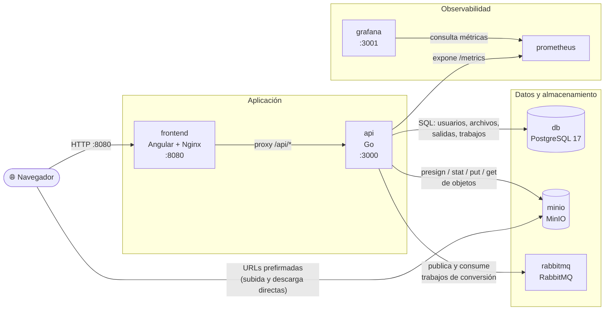

# OKF Converter

OKF Converter es una aplicación web para convertir documentos subidos en
fragmentos de texto plano. Un usuario se autentica, sube un archivo, y el
backend extrae su texto y lo divide en salidas `.txt` por párrafo que se
pueden descargar individualmente.

## Arquitectura

| Servicio     | Tecnología                         | Propósito                                     |
| ------------ | ----------------------------------- | ----------------------------------------------- |
| `frontend`   | Angular 21, servido con Nginx       | Páginas de autenticación + dashboard            |
| `api`        | Go                                   | API REST, autenticación, pipeline de conversión |
| `db`         | PostgreSQL 17                       | Usuarios, archivos, salidas                     |
| `minio`      | MinIO                               | Almacenamiento de archivos subidos y salidas    |
| `rabbitmq`   | RabbitMQ                            | Cola de trabajos de conversión                  |
| `prometheus` | Prometheus                          | Recolección de métricas (`/metrics` en `api`)   |
| `grafana`    | Grafana                             | Dashboards sobre las métricas de Prometheus     |

Flujo de subida: el frontend pide al API una URL prefirmada de subida, sube
el archivo directamente a MinIO, y luego confirma la subida. El API encola
un trabajo de conversión en RabbitMQ; un pool de workers dentro del proceso
`api` extrae el texto del documento (`backend/internal/convert/extract.go`)
y lo divide en fragmentos por párrafo, guardando cada uno como un objeto
`.txt` en MinIO (`backend/internal/convert/split.go`).

## Diagramas

### Arquitectura de contenedores

Cada bloque es un contenedor de `docker-compose.yml`; las flechas indican
qué contenedores se comunican entre sí y con qué propósito.



### Flujo de datos y proceso de decisión

Desde que un usuario sube un archivo hasta que puede descargar el resultado,
incluyendo las decisiones que toma el sistema en cada paso (validación de
tamaño, formato del documento, tamaño de los fragmentos y resultado final
de la conversión).


## Ejecutar la aplicación

Requiere Docker y Docker Compose. Todo el stack se levanta con un solo
comando:

```bash
docker compose up --build
```

o, equivalentemente, `make up` (ver [Comandos make](#comandos-make)).

Una vez en ejecución:

- App: http://localhost:8080 (crear una cuenta y luego iniciar sesión para acceder a `/dashboard`)
- Consola de MinIO: http://localhost:9001 (`minioadmin` / `minioadminpassword`)
- Panel de administración de RabbitMQ: http://localhost:15672 (`okf` / `okf_password`)
- Prometheus: http://localhost:9090
- Grafana: http://localhost:3001 (`admin` / `admin`)

La API no publica ningún puerto en el host: se accede a través del proxy
inverso del frontend, en http://localhost:8080/api/.

## Configuración

Toda la configuración —credenciales, puertos y endpoints— vive en el archivo
[`.env`](.env) de la raíz, fuera del código y fuera de `docker-compose.yml`,
que solo describe el cableado entre servicios e interpola esas variables.
`make urls` imprime las direcciones y credenciales realmente en uso, y
`make config` muestra el compose ya resuelto.

`.env` está versionado a propósito: contiene únicamente valores de
desarrollo local, y es lo que permite que `docker compose up` funcione desde
un clon limpio sin pasos previos. Para un despliegue real:

```bash
cp .env .env.local          # .env.local está en .gitignore
# editar JWT_SECRET y todas las contraseñas, y APP_ENV=production
docker compose --env-file .env.local up --build
```

`APP_ENV=production` activa el flag `Secure` de la cookie de sesión, que
exige servir la aplicación por HTTPS.

El backend en Go lee estas variables desde el entorno del proceso; ninguna
tiene valor de configuración escrito en el código. La lista completa, con sus
valores por defecto, está en `backend/internal/config/config.go`.

## Comandos make

`make help` lista todos los targets. Los más usados:

| Comando | Qué hace |
| --- | --- |
| `make up` | Levanta todo el stack en segundo plano |
| `make up-fg` | Igual, en primer plano y con logs |
| `make fresh` | Borra volúmenes y levanta el stack desde cero |
| `make down` / `make reset` | Detiene los contenedores / además borra los volúmenes |
| `make logs` / `make logs-one S=api` | Logs de todo / de un servicio |
| `make scale SERVICE=worker N=3` | Escala un servicio |
| `make queue` | Estado de la cola de conversión en RabbitMQ |
| `make psql` | Consola de PostgreSQL |
| `make urls` / `make config` | URLs y credenciales en uso / compose resuelto |
| `make test` | Pruebas de backend y frontend |
| `make check` | `go vet` + compilación + todas las pruebas |

Los targets de pruebas y compilación corren dentro de contenedores, así que
no hace falta tener Go ni Node instalados en la máquina.

## Estructura del proyecto

```
backend/         API en Go (autenticación, archivos, pipeline de conversión)
  cmd/api/        Punto de entrada
  internal/
    auth/          Registro, login, JWT, hashing de contraseñas
    convert/        Consumidor de la cola, extracción de texto, división en párrafos
    files/          Handlers de subida/confirmación/salidas
    storage/        Wrapper del cliente de MinIO
    middleware/      Guard de autenticación, recuperación de panics
    metrics/         Métricas de Prometheus
frontend/        App de Angular (login/registro/dashboard)
database/        SQL de inicialización de Postgres
observability/   Configuración de Prometheus y dashboards/provisioning de Grafana
```

## Desarrollo del backend

El API es un módulo estándar de Go en `backend/`.

```bash
cd backend
go build ./...
go test ./...
```

Para ejecutarlo fuera de Docker se necesita tener Postgres, MinIO y RabbitMQ
accesibles, además de las variables de entorno definidas en
`docker-compose.yml` (`DATABASE_URL`, `RABBITMQ_URL`, `JWT_SECRET`,
`MINIO_*`, etc. — ver `backend/internal/config/config.go` para la lista
completa y sus valores por defecto).

## Desarrollo del frontend

```bash
cd frontend
npm install
npm start        # ng serve, http://localhost:4200
```

Las pruebas unitarias usan [Vitest](https://vitest.dev/):

```bash
npm test
```

El servidor de desarrollo redirige las llamadas al API hacia el origen que
esté configurado en el entorno; para desarrollar contra el stack completo,
levantar el backend y sus dependencias con
`docker compose up db minio rabbitmq api`.
