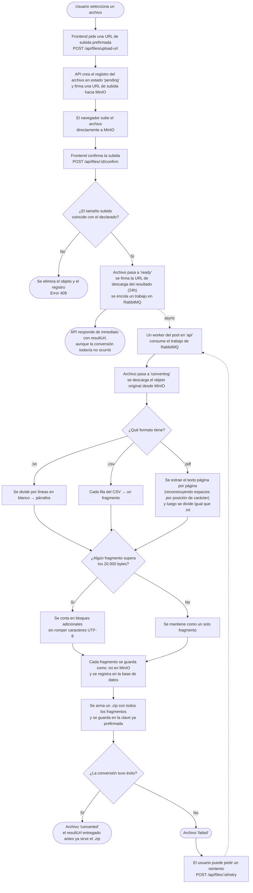

# OKF Converter

OKF Converter es una aplicación web para convertir documentos subidos en
fragmentos de texto plano. Un usuario se autentica, sube un archivo, y el
backend extrae su texto y lo divide en salidas `.txt` por párrafo que se
pueden descargar individualmente.

## Arquitectura

| Servicio     | Tecnología                         | Propósito                                     |
| ------------ | ----------------------------------- | ----------------------------------------------- |
| `frontend`   | Angular 21, servido con Nginx       | Páginas de autenticación + dashboard            |
| `api`        | Go                                   | API REST, autenticación, pipeline de conversión |
| `db`         | PostgreSQL 17                       | Usuarios, archivos, salidas                     |
| `minio`      | MinIO                               | Almacenamiento de archivos subidos y salidas    |
| `rabbitmq`   | RabbitMQ                            | Cola de trabajos de conversión                  |
| `prometheus` | Prometheus                          | Recolección de métricas (`/metrics` en `api`)   |
| `grafana`    | Grafana                             | Dashboards sobre las métricas de Prometheus     |

Flujo de subida: el frontend pide al API una URL prefirmada de subida, sube
el archivo directamente a MinIO, y luego confirma la subida. El API encola
un trabajo de conversión en RabbitMQ; un pool de workers dentro del proceso
`api` extrae el texto del documento (`backend/internal/convert/extract.go`)
y lo divide en fragmentos por párrafo, guardando cada uno como un objeto
`.txt` en MinIO (`backend/internal/convert/split.go`).

## Diagramas

### Arquitectura de contenedores

Cada bloque es un contenedor de `docker-compose.yml`; las flechas indican
qué contenedores se comunican entre sí y con qué propósito.


### Flujo de datos y proceso de decisión

Desde que un usuario sube un archivo hasta que puede descargar el resultado,
incluyendo las decisiones que toma el sistema en cada paso (validación de
tamaño, formato del documento, tamaño de los fragmentos y resultado final
de la conversión).



## Ejecutar la aplicación

Requiere Docker y Docker Compose.

```bash
docker compose up --build
```

Una vez en ejecución:

- App: http://localhost:8080 (crear una cuenta y luego iniciar sesión para acceder a `/dashboard`)
- API: http://localhost:3000
- Consola de MinIO: http://localhost:9001 (`minioadmin` / `minioadminpassword`)
- Panel de administración de RabbitMQ: http://localhost:15672 (`okf` / `okf_password`)
- Prometheus: http://localhost:9090
- Grafana: http://localhost:3001 (`admin` / `admin`)

`docker-compose.yml` define credenciales y secretos por defecto solo para
desarrollo local — cambiar `JWT_SECRET` y las demás contraseñas antes de
desplegar en un entorno real.

## Estructura del proyecto

```
backend/         API en Go (autenticación, archivos, pipeline de conversión)
  cmd/api/        Punto de entrada
  internal/
    auth/          Registro, login, JWT, hashing de contraseñas
    convert/        Consumidor de la cola, extracción de texto, división en párrafos
    files/          Handlers de subida/confirmación/salidas
    storage/        Wrapper del cliente de MinIO
    middleware/      Guard de autenticación, recuperación de panics
    metrics/         Métricas de Prometheus
frontend/        App de Angular (login/registro/dashboard)
database/        SQL de inicialización de Postgres
observability/   Configuración de Prometheus y dashboards/provisioning de Grafana
```

## Desarrollo del backend

El API es un módulo estándar de Go en `backend/`.

```bash
cd backend
go build ./...
go test ./...
```

Para ejecutarlo fuera de Docker se necesita tener Postgres, MinIO y RabbitMQ
accesibles, además de las variables de entorno definidas en
`docker-compose.yml` (`DATABASE_URL`, `RABBITMQ_URL`, `JWT_SECRET`,
`MINIO_*`, etc. — ver `backend/internal/config/config.go` para la lista
completa y sus valores por defecto).

## Desarrollo del frontend

```bash
cd frontend
npm install
npm start        # ng serve, http://localhost:4200
```

Las pruebas unitarias usan [Vitest](https://vitest.dev/):

```bash
npm test
```

El servidor de desarrollo redirige las llamadas al API hacia el origen que
esté configurado en el entorno; para desarrollar contra el stack completo,
levantar el backend y sus dependencias con
`docker compose up db minio rabbitmq api`.
