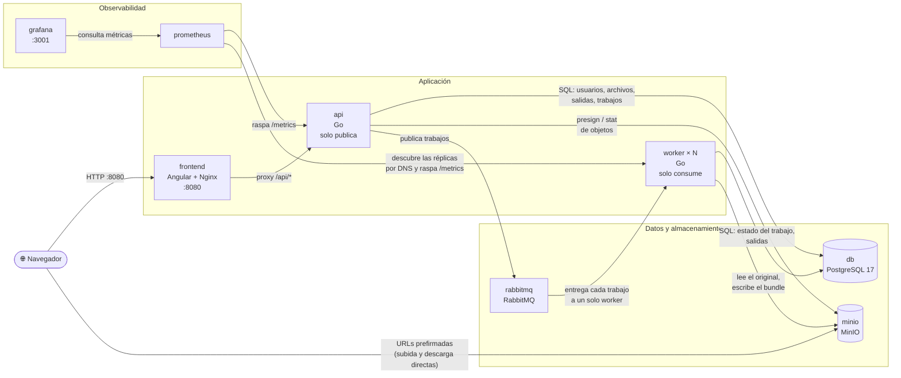
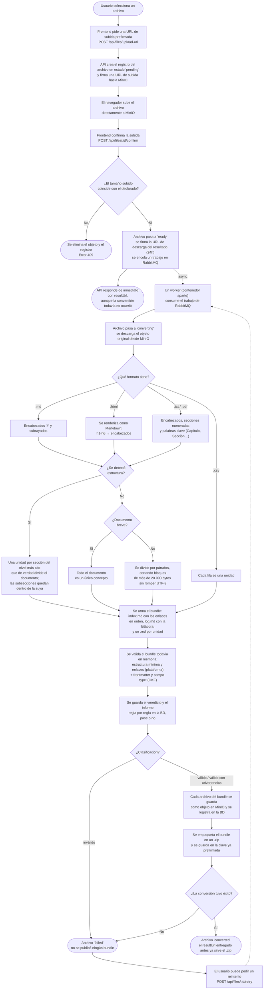

# OKF Converter

OKF Converter es una aplicación web multiusuario que convierte documentos en
bundles de conocimiento en formato OKF. Un usuario se autentica y sube un
archivo; la API responde de inmediato con un identificador de trabajo y la
conversión ocurre en segundo plano, en workers independientes. El resultado
es un bundle: una carpeta autocontenida con un índice, una bitácora de la
conversión y un documento Markdown por cada unidad lógica del documento
original.

## El bundle

```
notas-de-clase/
├── index.md              navegación y datos del bundle
├── log.md                trazabilidad de la conversión
├── 01-introduccion.md    un documento por unidad lógica,
├── 02-metodologia.md     numerado en el orden del original
└── 03-conclusiones.md
```

`index.md` enumera y enlaza los conceptos en el orden del documento de
origen, junto con los datos del bundle (documento original, tipo, tamaño,
número de unidades y trabajo que lo produjo). `log.md` registra, con marca de
tiempo, cada operación de la conversión y una tabla de las unidades
detectadas con su procedencia. Cada concepto abre con su título, lleva el
contenido de su unidad y cierra con enlaces al índice y a sus vecinos, de
modo que el bundle se puede recorrer completo desde cualquier archivo.

Todos los archivos llevan frontmatter YAML, como pide
[Open Knowledge Format v0.1](https://cloud.google.com/blog/products/data-analytics/how-the-open-knowledge-format-can-improve-data-sharing),
que define un bundle como un directorio de Markdown con frontmatter y exige
exactamente un campo en cada concepto: `type`. Se rellenan además los campos
estándar consultables que el generador puede conocer:

```yaml
---
type: "concept"
title: "Introducción"
description: "Unidad 1 de 3 del documento «notas-de-clase.md»."
tags: ["okf", "notas-de-clase"]
source: "notas-de-clase.md"
timestamp: 2026-08-15T18:42:04Z
---
```

`index.md` y `log.md` son nombres reservados por la especificación y llevan
`type: index` y `type: log`. Los conceptos se enlazan entre sí con enlaces
Markdown normales, que es la forma en que OKF representa el grafo de
relaciones.

Un resultado exitoso nunca es un Markdown suelto: o se generan todos los
archivos del bundle, o el trabajo falla. Un documento breve sin divisiones
produce un bundle igual de válido, con `index.md`, `log.md` y un único
concepto.

Los archivos del bundle se guardan además como objetos individuales en MinIO,
así que se puede leer `index.md` sin descargar el paquete completo, y el
bundle entero se empaqueta como un `.zip` con una sola carpeta raíz.

## Formatos de entrada y segmentación

Una unidad lógica es una sección del documento, no un párrafo arbitrario. La
segmentación parte de la estructura del propio documento:

| Formato | Cómo se detecta la estructura |
| --- | --- |
| Markdown (`.md`) | Encabezados ATX (`#`) y subrayados setext; lo que está dentro de un bloque de código no cuenta |
| HTML (`.html`, `.htm`) | Se renderiza a Markdown (`<h1>`–`<h6>` → encabezados) y se segmenta igual; `<script>`, `<style>` y `<head>` se descartan |
| Texto plano (`.txt`) | Encabezados Markdown, secciones numeradas (`3.1 Metodología`, `1. Introducción`) y palabras clave (`Capítulo IV`, `Sección 2`) |
| PDF (`.pdf`) | Se extrae el texto reconstruyendo los espacios por posición de carácter y se trata como texto plano |
| CSV (`.csv`) | Cada fila es una unidad; ninguna detección de encabezados encontraría sus divisiones reales |

Dos decisiones que vale la pena conocer:

- **Se segmenta por el nivel más alto que de verdad divide el documento.** Un
  informe cuyo único encabezado de nivel 1 es su propio título se divide por
  sus secciones de nivel 2, no se deja entero. Las subsecciones quedan dentro
  de la sección a la que pertenecen.
- **Sin estructura, un documento breve es un solo concepto**, que es
  exactamente lo que pide el enunciado para el caso del documento corto sin
  divisiones. Solo un documento sin estructura y demasiado grande para eso
  (más de 20.000 bytes) cae al respaldo de dividir por párrafos.

El formato se valida en la recepción: una subida que el pipeline no podría
convertir se rechaza con `415` antes de firmar la URL, en vez de aceptarse y
fallar en un worker minutos después.

## Validación del bundle

Ningún bundle se publica sin haber sido validado. La comprobación ocurre
mientras el bundle todavía está en memoria, así que un bundle inválido nunca
llega al almacenamiento de objetos y nunca se ofrece para descarga.

Se miden dos cosas por separado:

- **Validez de plataforma** — ¿es un bundle usable?
- **Conformidad OKF** — ¿cumple la especificación Open Knowledge Format v0.1?

| Regla | Ámbito | Severidad |
| --- | --- | --- |
| Contiene `index.md`, `log.md` y al menos un concepto | plataforma | error |
| Todos los enlaces de `index.md` resuelven dentro del bundle | plataforma | error |
| Todos los conceptos son alcanzables desde `index.md` | plataforma | error |
| Los enlaces relativos dentro de los conceptos resuelven | plataforma | advertencia |
| Todos los archivos abren con frontmatter YAML | OKF | error |
| Todos los archivos declaran el campo obligatorio `type` | OKF | error |
| Todos los archivos traen los campos estándar consultables | OKF | advertencia |
| `index.md` y `log.md` declaran el tipo de su rol | OKF | advertencia |

El resultado se clasifica en **válido**, **válido con advertencias** o
**inválido**, y se guarda en la tabla `files` (`validation` y el informe regla
por regla en `validation_report`). Un bundle inválido deja el archivo en
`failed` con el motivo; uno con advertencias se publica igual y las reporta.

Que una regla sea *advertencia* y no *error* tiene una razón concreta: el
cuerpo de un concepto arrastra el Markdown del documento original, así que un
enlace relativo que el autor escribió hacia un archivo que no subió es un
defecto real que hay que reportar, pero no uno por el que valga la pena negarse
a entregar el bundle.

El veredicto completo queda también dentro del propio bundle, en la sección
`## Validación` de `log.md`, con todas las reglas —las superadas incluidas—,
que es lo que pide el §3 del enunciado sobre trazabilidad.

## Arquitectura

| Servicio     | Tecnología                         | Propósito                                     |
| ------------ | ----------------------------------- | ----------------------------------------------- |
| `frontend`   | Angular 21, servido con Nginx       | Páginas de autenticación + dashboard            |
| `api`        | Go                                   | API REST, autenticación, publica trabajos       |
| `worker`     | Go                                   | Consume trabajos y ejecuta la conversión        |
| `db`         | PostgreSQL 17                       | Usuarios, archivos, salidas                     |
| `minio`      | MinIO                               | Almacenamiento de archivos subidos y salidas    |
| `rabbitmq`   | RabbitMQ                            | Cola de trabajos de conversión                  |
| `prometheus` | Prometheus                          | Recolección de métricas (`/metrics` en `api`)   |
| `grafana`    | Grafana                             | Dashboards sobre las métricas de Prometheus     |

Flujo de subida: el frontend pide al API una URL prefirmada de subida, sube
el archivo directamente a MinIO, y luego confirma la subida. El API encola
un trabajo de conversión en RabbitMQ y responde de inmediato; a partir de
ahí no vuelve a intervenir.

`api` y `worker` son dos binarios (`backend/cmd/api` y `backend/cmd/worker`)
del mismo módulo de Go, construidos en la misma imagen y separados a
propósito: el API solo publica en la cola y el worker solo consume. Comparten
la base de datos, el almacenamiento y la cola, pero nunca se comunican entre
sí. Por eso la conversión no puede ocupar una petición HTTP, y los workers se
escalan sin tocar el API:

```bash
make scale N=4          # docker compose up -d --scale worker=4
```

Cada contenedor de worker convierte `WORKER_CONCURRENCY` trabajos en
paralelo, así que el paralelismo total es réplicas × concurrencia. RabbitMQ
entrega cada trabajo a un solo consumidor, con `prefetch` acotado para que la
carga se reparta en vez de que un consumidor acapare la cola.

## Diagramas

### Arquitectura de contenedores

Cada bloque es un contenedor de `docker-compose.yml`; las flechas indican
qué contenedores se comunican entre sí y con qué propósito.



### Flujo de datos y proceso de decisión

Desde que un usuario sube un archivo hasta que puede descargar el bundle,
incluyendo las decisiones que toma el sistema en cada paso (validación de
tamaño, formato del documento, tamaño de los bloques, validación del bundle
generado y resultado final de la conversión).



## Ejecutar la aplicación

Requiere Docker y Docker Compose. Todo el stack se levanta con un solo
comando:

```bash
docker compose up --build
```

o, equivalentemente, `make up` (ver [Comandos make](#comandos-make)).

Una vez en ejecución:

- App: http://localhost:8080 (crear una cuenta y luego iniciar sesión para acceder a `/dashboard`)
- Consola de MinIO: http://localhost:9001 (`minioadmin` / `minioadminpassword`)
- Panel de administración de RabbitMQ: http://localhost:15672 (`okf` / `okf_password`)
- Prometheus: http://localhost:9090
- Grafana: http://localhost:3001 (`admin` / `admin`)

La API no publica ningún puerto en el host: se accede a través del proxy
inverso del frontend, en http://localhost:8080/api/.

## Configuración

Toda la configuración —credenciales, puertos y endpoints— vive en el archivo
[`.env`](.env) de la raíz, fuera del código y fuera de `docker-compose.yml`,
que solo describe el cableado entre servicios e interpola esas variables.
`make urls` imprime las direcciones y credenciales realmente en uso, y
`make config` muestra el compose ya resuelto.

`.env` está versionado a propósito: contiene únicamente valores de
desarrollo local, y es lo que permite que `docker compose up` funcione desde
un clon limpio sin pasos previos. Para un despliegue real:

```bash
cp .env .env.local          # .env.local está en .gitignore
# editar JWT_SECRET y todas las contraseñas, y APP_ENV=production
docker compose --env-file .env.local up --build
```

`APP_ENV=production` activa el flag `Secure` de la cookie de sesión, que
exige servir la aplicación por HTTPS.

El backend en Go lee estas variables desde el entorno del proceso; ninguna
tiene valor de configuración escrito en el código. La lista completa, con sus
valores por defecto, está en `backend/internal/config/config.go`.

## Comandos make

`make help` lista todos los targets. Los más usados:

| Comando | Qué hace |
| --- | --- |
| `make up` | Levanta todo el stack en segundo plano |
| `make up-fg` | Igual, en primer plano y con logs |
| `make fresh` | Borra volúmenes y levanta el stack desde cero |
| `make down` / `make reset` | Detiene los contenedores / además borra los volúmenes |
| `make logs` / `make logs-one S=api` | Logs de todo / de un servicio |
| `make scale SERVICE=worker N=3` | Escala un servicio |
| `make queue` | Estado de la cola de conversión en RabbitMQ |
| `make psql` | Consola de PostgreSQL |
| `make urls` / `make config` | URLs y credenciales en uso / compose resuelto |
| `make test` | Pruebas de backend y frontend |
| `make check` | `go vet` + compilación + todas las pruebas |

Los targets de pruebas y compilación corren dentro de contenedores, así que
no hace falta tener Go ni Node instalados en la máquina.

## Estructura del proyecto

```
backend/         Backend en Go (un módulo, dos binarios)
  cmd/api/        Punto de entrada del API: publica trabajos, nunca convierte
  cmd/worker/     Punto de entrada del worker: consume trabajos y convierte
  internal/
    auth/          Registro, login, JWT, hashing de contraseñas
    bundle/         Construcción del bundle OKF: index.md, log.md y conceptos
    convert/        Cola, extracción de texto, detección de unidades, pipeline
    files/          Handlers de subida/confirmación/salidas
    storage/        Wrapper del cliente de MinIO
    middleware/      Guard de autenticación, recuperación de panics
    metrics/         Métricas de Prometheus
frontend/        App de Angular (login/registro/dashboard)
database/        SQL de inicialización de Postgres
observability/   Configuración de Prometheus y dashboards/provisioning de Grafana
```

## Desarrollo del backend

El API es un módulo estándar de Go en `backend/`.

```bash
cd backend
go build ./...
go test ./...
```

Para ejecutarlo fuera de Docker se necesita tener Postgres, MinIO y RabbitMQ
accesibles, además de las variables de entorno definidas en
`docker-compose.yml` (`DATABASE_URL`, `RABBITMQ_URL`, `JWT_SECRET`,
`MINIO_*`, etc. — ver `backend/internal/config/config.go` para la lista
completa y sus valores por defecto).

## Desarrollo del frontend

```bash
cd frontend
npm install
npm start        # ng serve, http://localhost:4200
```

Las pruebas unitarias usan [Vitest](https://vitest.dev/):

```bash
npm test
```

El servidor de desarrollo redirige las llamadas al API hacia el origen que
esté configurado en el entorno; para desarrollar contra el stack completo,
levantar el backend y sus dependencias con
`docker compose up db minio rabbitmq api`.
